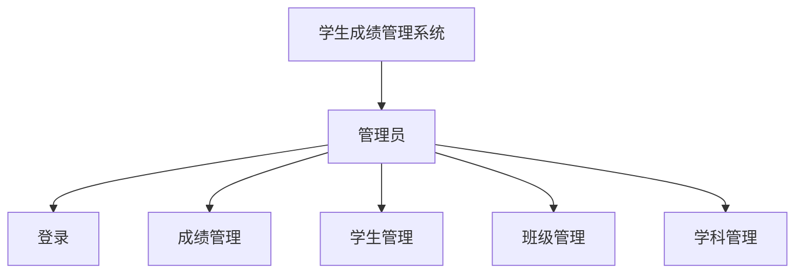
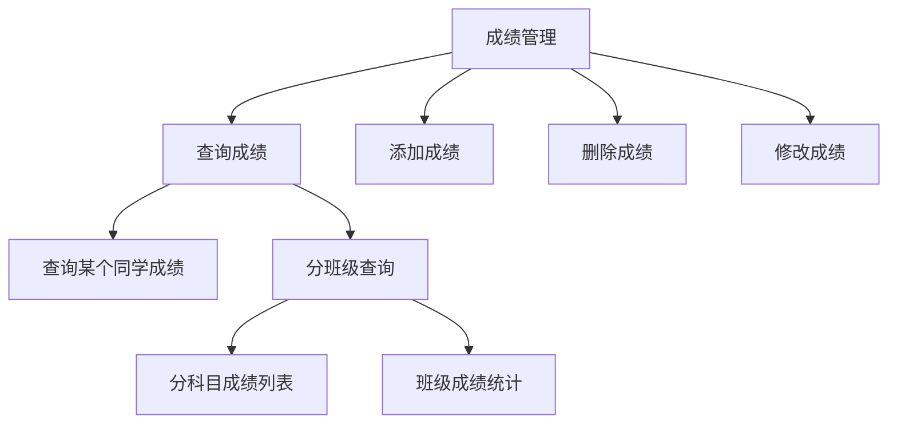
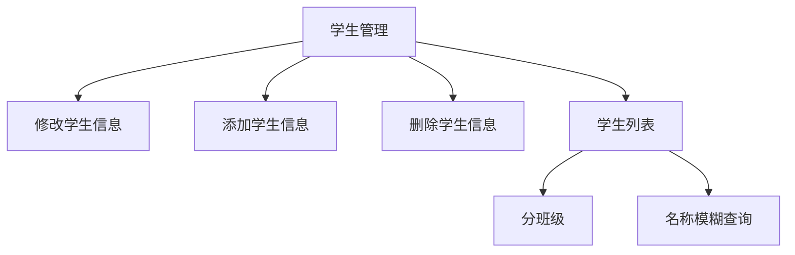
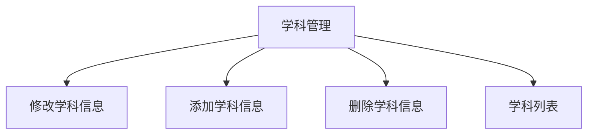
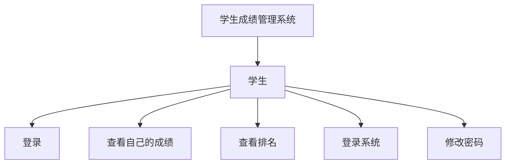

# 学生成绩管理系统

## 功能设计

### 管理员

#### 分类



#### 成绩管理



#### 学生管理



#### 学科管理



#### 班级管理


### 学生




## 数据库设计

### 数据库表

#### admin(管理员表)

| 字段名     | 类型     | 长度 | 注释     |
| ---------- | -------- | ---- | -------- |
| mid        | varchar  | 10   | 管理员id |
| password   | varchar  | 10   | 密码     |
| createTime | datatime |      | 创建时间 |

#### student(学生表)

| 字段名     | 类型     | 长度 | 注释     |
| ---------- | -------- | ---- | -------- |
| sid        | varchar  | 10   | 学号     |
| password   | varchar  | 10   | 密码     |
| createTime | datetime |      | 创建时间 |
| gender     | char     | 3    | 性别     |
| birth      | date     |      | 出生年月 |
| name       | varchar  | 10   | 学生姓名 |
| classid    | varchar  | 10   | 班级号   |

#### subject(学科表)

| 字段名     | 类型     | 长度 | 注释     |
| ---------- | -------- | ---- | -------- |
| subid      | varchar  | 10   | 学科号   |
| name       | varchar  | 10   | 学科名   |
| createTime | datatime |      | 创建时间 |
| total      | int      |      | 总分     |

#### class(班级表)

| 字段名     | 类型     | 长度 | 注释     |
| ---------- | -------- | ---- | -------- |
| classid    | varchar  | 10   | 班级号   |
| name       | varchar  | 10   | 班级名称 |
| createTime | datatime |      | 创建时间 |

#### score(成绩表)

| 字段名     | 类型     | 长度  | 注释         |
| ---------- | -------- | ----- | ------------ |
| scoreid    | varchar  | 10    | 成绩记录编号 |
| sid        | varchar  | 10    | 学生编号     |
| subid      | varchar  | 10    | 学科编号     |
| grade      | decimal  | (3,1) | 成绩         |
| createTime | datatime |       | 创建时间     |

### 数据库语句设计

#### 视图

+ class_and_subject_statistics

```sql
SELECT
	AVG(score.grade) AS average,
	MAX(score.grade) AS max,
	MIN(score.grade) AS min,
    (
        SELECT COUNT(*) AS Expr1 
     	FROM student 
     	WHERE classid = class.classid
    ) AS classCount, 
    COUNT(*) AS testCount,
    (
        SELECT COUNT(*) AS Expr1
        FROM score_detail
        WHERE 
        	grade >= total * 0.6 
        	AND classid = class.classid 
        	AND subid = score.subid
    ) AS passCount,
    (
        SELECT COUNT(*) AS Expr1
        FROM score_detail AS score_detail_1
        WHERE 
        	grade >= total * 0.8
        	AND classid = class.classid
        	AND subid = score.subid
    ) AS goodCount, 
    score.subid, 
    class.classid
	FROM 
		score INNER JOIN student AS student_1 
			ON score.sid = student_1.sid 
    			INNER JOIN subject
    				ON score.subid = subject.subid 
                		INNER JOIN class 
                			ON student_1.classid = class.classid
	GROUP BY score.subid, class.classid
```


+ score_detail

```sql
SELECT 
	score.grade,
	subject.total,
    student.name,
    student.gender,
    student.birth,
    class.name AS class,
    subject.name AS subject,
    class.classid,
    score.subid,
    score.sid,
    score.scoreid
    FROM
    	score INNER JOIN student
        	ON score.sid = student.sid
        		INNER JOIN subject
        			ON score.subid = subject.subid
        				INNER JOIN class
        					ON student.classid = class.classid
```


#### 功能实现

+ 管理员登录

  ```sql
  SELECT COUNT(*) FROM admin WHERE mid=#{mid} AND password=#{password}
  ```

+ 成绩管理

  + 某个同学查询成绩

  ```sql
  SELECT grade,total,subject,subid FROM score_detail WHERE sid=#{sid};
  SELECT grade,total,subject,subid FROM score_detail WHERE name=#{name};
  ```
  
  
  
  + 分班分科目查询成绩列表: {grade,total,name,gender,birth,class,sid}
  
  ```sql
  SELECT * FROM score_detail WHERE classid=#{classid} AND subid=#{subid};
  ```
  
  
  
  + 查询班级成绩统计数据
  
  ```sql
  SELECT * FROM class_and_subject_statistics WHERE classid=#{classId} AND subid=#{subid} 
  ```

  

  + 添加成绩
  
  ```sql
  INSERT INTO score (scoreid,sid,subid,grade,createTime) VALUES(#{scoreid},#{sid},#{subid},#{grade},Getdate())
  ```
  
  + 删除成绩
  
  ```sql
  DELETE FROM score WHERE scoreid=#{scoreId}
  ```
  
  + 修改成绩
  
  ```sql
  UPDATE score SET grade={grade} WHERE scoreid=#{scoreId}
  ```
  
+ 学生管理

  + 分班级查询学生信息

  ```sql
  select * from student where classid=#{c00001};
  ```

  + 按照名字模糊查询学生信息

  ```sql
  SELECT  student.name as name,sid,gender,birth,class.name as className FROM student,class WHERE student.classid=class.classid AND student.name LIKE CONNACT('%',#{value},'%')
  ```

  + 添加学生信息
  
  ```sql
  INSERT INTO student (name,sid,gender,classid,birth,createTime) VALUES (#{name},#{sid},#{gender},#{classId},#{birth},Getdate())
  ```
  
  + 修改学生信息
  
  ```sql
  UPDATE student SET name=#{name},classid=#{classId},gender=#{gender},birth=#{birth} WHERE sid=#{sid}
  ```
  
  + 删除学生信息
  
  ```sql
  DELETE FROM student WHERE sid=#{sid}
  ```
  
+ 班级管理

  + 查询班级列表

    ```sql
    SELECT * FROM class WHERE name LIKE '%#{name}%'
    ```

  + 修改班级信息

    ```sql
    UPDATE class SET name=#{className} WHERE classid=#{classId}
    ```

  + 添加班级信息

    ```sql
    INSERT INTO class (classid,name,createTime) VALUES (#{classId},#{className},Getdate())
    ```

  + 删除班级信息

    ```sql
    DELETE FROM class WHERE classid=#{classId}
    ```

+ 学科管理

  + 查询学科列表
  
    ```sql
    SELECT * FROM subject
    ```
  
  + 添加学科信息
  
    ```sql
    INSERT INTO subject (subid,name,total,createTime) VALUES (#{subId},#{subName},#{total},Getdate())
    ```
  
  + 删除学科信息
  
    ```sql
    DELETE FROM subject WHERE subid=#{subId}
    ```